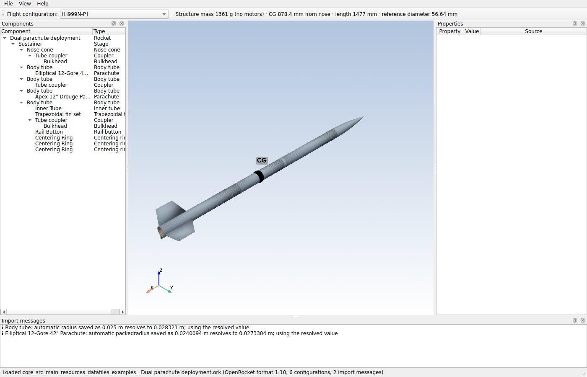

# Stress & Aero

Windows desktop application for **aerodynamic, flight and structural/stress analysis of rockets**, built from
OpenRocket `.ork` files, detailed CAD models (STEP/STL), or both — with every number labelled by the method that
produced it (estimate, OpenRocket method, engineering method, geometry-based, CFD, FEA).

## Status

| Milestone | Scope | State |
|---|---|---|
| **M1 Foundation** | `.ork` import (all versions), exact OpenRocket geometry/mass/CG, 3-D viewer with picking, inspector, configurations, units, projects, Windows installer | **done** |
| M2 Aerodynamics | OpenRocket-compatible + extended (Mach 0–3) aero, CP/CNα/drag, stability display | next |
| M3 Flight | 6-DOF launch simulation, motors, wind/turbulence, dual-deploy recovery with opening shock, playback with live aero | planned |
| M4 CAD replacement | Replace OpenRocket parts with STEP/STL geometry, align, mass properties, original-vs-detailed comparison | planned |
| M5 Structures | Loads, stresses, buckling, composites (CLT), fin flutter, recovery loads, material database | planned |
| M6 CFD | SU2 pipeline with progress bar, flight CFD database, airflow visualisation during playback | planned |
| M7 FEA | CalculiX pipeline, stress/deformation heatmaps, modal → flutter | planned |
| M8 Studies | Sweeps, wind sweeps, Monte Carlo, comparisons, reports and exports | planned |

Design: [`docs/superpowers/specs/2026-10-05-rocket-analysis-app-design.md`](docs/superpowers/specs/2026-10-05-rocket-analysis-app-design.md) ·
plans: [`docs/superpowers/plans/`](docs/superpowers/plans/) · feasibility research: [`docs/research/`](docs/research/).

## What M1 does

- Opens OpenRocket files from every format version (ZIP, GZIP and plain XML; OpenRocket 23.09 and 24.x included),
  re-deriving positions and "automatic" dimensions exactly as OpenRocket does — stale values saved in the file are
  detected and reported.
- Reproduces OpenRocket 24.12's own geometry, component masses, structure mass/CG, reference diameter and overall
  length for **every component of all 73 OpenRocket sample files** (regression-tested against values produced by
  OpenRocket itself).
- Interactive 3-D model: click a part (or pick it in the component tree) to inspect dimensions, material, mass and CG;
  CG marker; internal parts shown translucent; pods, clusters, canted fins and rail buttons placed exactly.
- Flight-configuration selector, metric / US customary units, project files (`.saproj`), import-message list.
- One-click Windows installer, no admin rights required.

## Install (users)

Step-by-step guide: [`docs/user/INSTALL.md`](docs/user/INSTALL.md). The installer `StressAero-Setup-<version>.exe` is
built automatically by GitHub Actions (artifact **StressAero-Setup** on each CI run).

## Develop

See [`docs/dev/DEVELOPING.md`](docs/dev/DEVELOPING.md): clone, `pip install -e ".[dev]"`, `python -m stressaero`,
`pytest`, build the installer.
